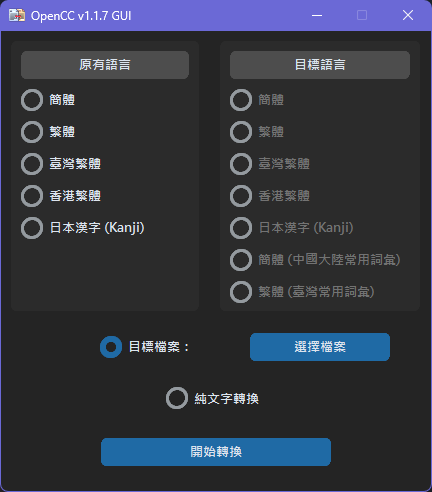
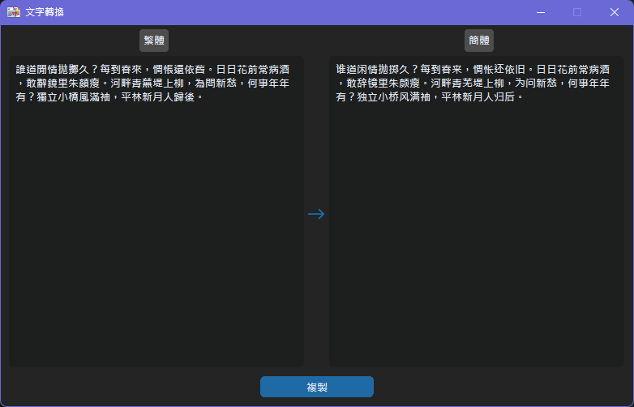

# OpenCC-GUI

GUI implementation of [OpenCC](https://github.com/BYVoid/OpenCC)

## Remarks 注意事項

- executables from [Release](https://github.com/ilvon/OpenCC-GUI/releases) are built with Pyinstaller 6.4.0 + Python 3.11.2
  - 執行檔由 Pyinstaller 6.4.0 及 Python 3.11.2 編譯而成
- encoding of files for conversion will be detected, no prior conversion (to UTF-8) is needed  
  - 轉換器會自動偵測文檔的編碼，因此毋需事先將其轉換成UTF-8
- all resulting files will be placed as same folder of the source files with suffix `_<target_language>` (e.g. `_简体`, `_繁體`)
  - 已轉換的檔案均會添加其目槱語言的後綴 (e.g. `_简体`, `_繁體`)