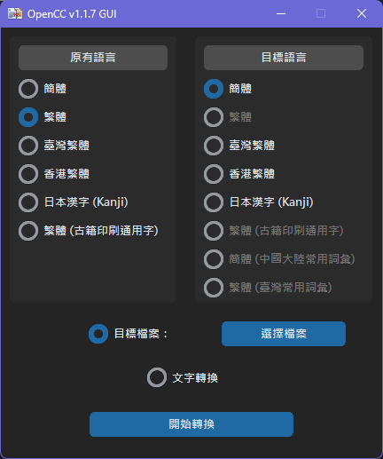
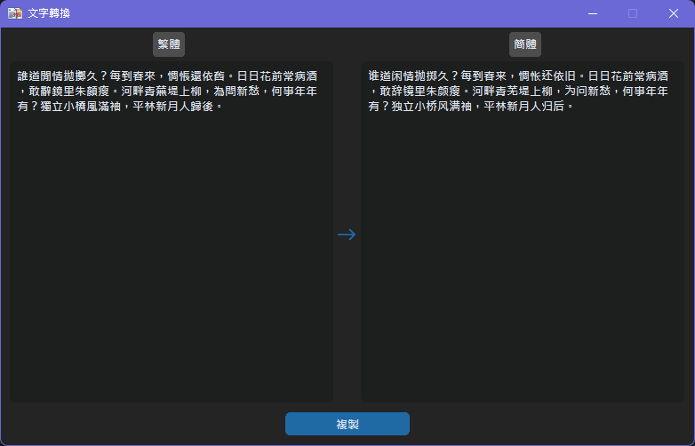

# OpenCC-GUI


GUI implementation of [OpenCC](https://github.com/BYVoid/OpenCC) with additon of [GujiCC](https://github.com/forFudan/GujiCC)




## Installation 安裝

```bash
pip install OpenCC-GUI
```

## Remarks 注意事項

- executables from [Release](https://github.com/ilvon/OpenCC-GUI/releases) are built with Pyinstaller
  - 執行檔由 Pyinstaller 編譯而成
- additional [GujiCC](https://github.com/forFudan/GujiCC) dictionary and config files need to be copied to OpenCC's library directory when running from source
  - 在執行原始碼時，[GujiCC](https://github.com/forFudan/GujiCC)的字典及設定檔需事先複製至已安裝之OpenCC目錄中
- encoding of files for conversion will be detected, no prior conversion (to UTF-8) is needed  
  - 轉換器會自動偵測文檔的編碼，因此毋需事先將其轉換成UTF-8
- all resulting files will be placed as same folder of the source files with suffix `_<target_language>` (e.g. `_简体`, `_繁體`)
  - 已轉換的檔案均會添加其目標語言的後綴 (e.g. `_简体`, `_繁體`)
